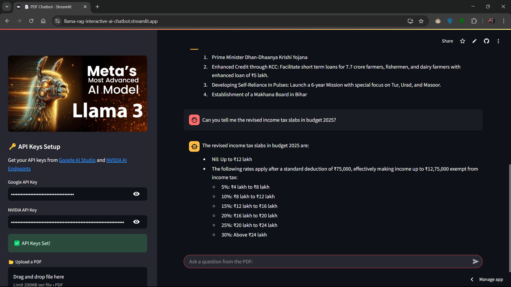

# 🦙 LlamaRAG-QA: AI-Powered Document Q&A  
**Interactive AI Chat with PDFs using Llama & RAG**  

## 📌 Table of Contents  
- [Introduction](#introduction)  
- [Features](#features)  
- [Installation](#installation)  
- [Usage](#usage)  
- [Project Structure](#project-structure)  
- [Tech Stack](#tech-stack)  
- [Screenshots](#screenshots)  
- [License](#license)  

## 🚀 Introduction  
LlamaRAG-QA is an AI-powered document chatbot built using **Streamlit, Llama, and Retrieval-Augmented Generation (RAG)**. It allows users to upload PDFs and interact with them in a conversational manner.  

## ✨ Features  
✔️ Upload and chat with any PDF  
✔️ Uses Llama & RAG for intelligent responses  
✔️ Streamlined UI with interactive chat  
✔️ Secure API key handling  
✔️ Sidebar-based document processing  

## 🛠️ Installation  
Clone the repository and install dependencies:  
```bash
git clone https://github.com/your-repo-name.git  
cd your-repo-name  
pip install -r requirements.txt
```
## Usage

After setting up the project, you can run the application by running the below command in the terminal:
   ```bash
   streamlit run app.py
  ```

## Project Structure

``` bash
├── backend/
│   ├── pdf_loader.py
│   ├── vector_store.py
│   ├── qa_chain.py
├── app.py
├── requirements.txt
├── README.md
```

## Tech Stack
1. Python
2. Streamlit
3. LangChain
4. Llama (Meta AI)
5. RAG (Retrieval-Augmented Generation)
6. Google & NVIDIA AI APIs

## Screenshots

Here is screenshot of the application:


## MIT License  

Copyright (c) 2024  

Permission is hereby granted, free of charge, to any person obtaining a copy  
of this software and associated documentation files (the "Software"), to deal  
in the Software without restriction, including without limitation the rights  
to use, copy, modify, merge, publish, distribute, sublicense, and/or sell  
copies of the Software, and to permit persons to whom the Software is  
furnished to do so, subject to the following conditions:  

The above copyright notice and this permission notice shall be included in all  
copies or substantial portions of the Software.  

THE SOFTWARE IS PROVIDED "AS IS", WITHOUT WARRANTY OF ANY KIND, EXPRESS OR  
IMPLIED, INCLUDING BUT NOT LIMITED TO THE WARRANTIES OF MERCHANTABILITY,  
FITNESS FOR A PARTICULAR PURPOSE, AND NONINFRINGEMENT. IN NO EVENT SHALL THE  
AUTHORS OR COPYRIGHT HOLDERS BE LIABLE FOR ANY CLAIM, DAMAGES, OR OTHER  
LIABILITY, WHETHER IN AN ACTION OF CONTRACT, TORT, OR OTHERWISE, ARISING FROM,  
OUT OF, OR IN CONNECTION WITH THE SOFTWARE OR THE USE OR OTHER DEALINGS IN THE  
SOFTWARE.  

